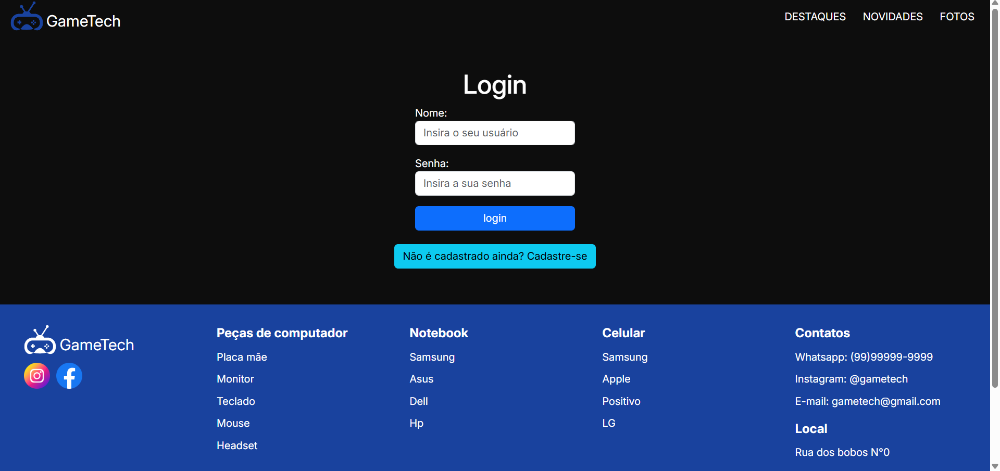

# GameTech - E-commerce de Eletrônicos para Gamers

Bem-vindo ao **GameTech**, uma loja virtual especializada em eletrônicos para gamers. Este projeto foi desenvolvido como parte de um curso de Desenvolvimento Fullstack no SENAI.

---

## 🚀 Visão Geral

O **GameTech** é um site de e-commerce focado em produtos eletrônicos para gamers, como celulares, notebooks, computadores e peças de hardware. O projeto inclui:

- Página inicial com destaques, novidades e fotos.
- Página de login e cadastro de usuários.
- Design responsivo para funcionar em dispositivos móveis, tablets e desktops.
- Interatividade com JavaScript e jQuery.

---

## 🛠️ Tecnologias Utilizadas

- **Frontend:**
  - HTML5
  - CSS3 (com Flexbox e Grid Layout)
  - JavaScript (Vanilla e jQuery)
  - Bootstrap (para componentes e carrossel)

- **Ferramentas:**
  - Git e GitHub (para versionamento)
  - Visual Studio Code (como editor de código)

---

## 📦 Como Rodar o Projeto Localmente

Siga os passos abaixo para rodar o projeto no seu computador:

### Pré-requisitos

- Um navegador moderno (Chrome, Firefox, Edge, etc.).
- Um editor de código (recomendamos o [Visual Studio Code](https://code.visualstudio.com/)).

### Passos

1. **Clone o repositório:**
   ```bash
   git clone https://github.com/seu-usuario/gametech-ecommerce.git

2. **Navegue até a pasta do projeto:**
   ```bash
    cd gametech-ecommerce

3. **Abra o projeto no seu editor de código:**
    Se estiver usando o Visual Studio Code, execute:
       
    ```bash
    code .

4. **Abra o arquivo index.html no navegador:**
    Clique com o botão direito no arquivo index.html e selecione "Abrir com" > "Seu navegador preferido".

---

## 🎨 Estrutura do Projeto

Aqui está a estrutura de pastas e arquivos do projeto:

```
gametech-ecommerce/
├── css/
│   └── style.css           # Estilos globais do site
├── img/                    # Pasta de imagens
│   ├── banner.png          # Banner da página inicial
│   ├── menu-icon.svg       # Ícone do menu mobile
│   └── usuario.svg         # Ícone do usuário
├── js/
│   ├── script.js           # Scripts de interatividade
│   └── jquery-script.js    # Scripts com jQuery
├── index.html              # Página inicial
├── login.html              # Página de login e cadastro
├── README.md               # Documentação do projeto
└── .gitignore              # Arquivo para ignorar arquivos desnecessários no Git
```

---

## 🖼️ Protótipo

### Página Inicial


### Página de Login


---

## 📝 Funcionalidades

### **Página Inicial:**
- Banner principal com chamada para ação.
- Seção de produtos em destaque.
- Carrossel de novidades.
- Galeria de fotos.

## **Página de Login:**
- Formulário de login.
- Formulário de cadastro com toggle entre login e cadastro.

## **Responsividade:**
- Layout adaptável para dispositivos móveis, tablets e desktops.

---

## 🤝 Como Contribuir

Contribuições são bem-vindas! Siga os passos abaixo:

1. Faça um fork do repositório.

2. Crie uma branch para sua feature ou correção:
    ```bash
    git checkout -b minha-feature

3. Faça commit das suas alterações:
    ```bash
    git commit -m "feat: adiciona nova funcionalidade"

4. Envie as alterações para o repositório remoto:
    ```bash
    git push origin minha-feature

5. Abra um Pull Request no GitHub.

---

## 👨‍💻 Autor

- **GitHub**: [gabsantosmr](https://github.com/gabsantosmr)
- **LinkedIn**: [Gabriel Rodrigues](https://www.linkedin.com/in/gabrielsmrodrigues/)